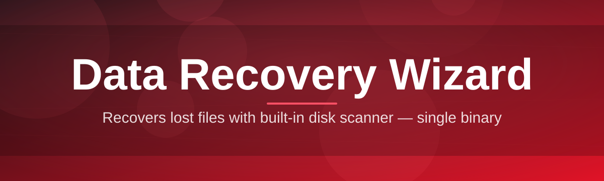

# data-recovery-assistant 🧩💾

  

*A calm, methodical companion for the worst moment in anyone's digital day — the one right after something disappears.*

  

## 🔍 Overview

**What this is NOT:** a magic wand, a guaranteed miracle, or a substitute for good backup hygiene. `data-recovery-assistant` will not resurrect a drive that has been physically destroyed, and it will not pretend to. We say this up front because the recovery space is full of tools that overpromise — this one is built on the opposite philosophy: transparent scanning, honest odds, and recoverable files handed back to you exactly as they were.

What it *does* do is take the chaos of accidental deletion, corrupted partitions, and formatted volumes, and turn it into a structured, readable map of what can still be salvaged. Under the hood, the Data Recovery Wizard walks your storage device sector by sector, reconstructs file signatures from fragments the operating system has already forgotten about, and presents you with a preview-first, recover-second workflow so you never restore blind. It's the digital equivalent of carefully sifting through ash to find the one photograph that survived.

This project exists for the people who need it most at 2 a.m.: the student whose thesis vanished with a bad `Shift+Delete`, the photographer whose SD card corrupted mid-shoot, the small-business owner staring at a partition that suddenly reads as "RAW." It's for hobbyists who want to understand *why* recovery works, and for contributors who enjoy the puzzle of low-level filesystem archaeology. No accounts, no subscriptions, no data leaving your machine — recovery should feel like a private, trustworthy process, not a transaction.

  

---

## 🧠 Capabilities That Actually Matter

  

- **Deep signature scanning** — goes beyond the file table and reconstructs files from raw byte patterns, catching things a quick scan would walk right past.

- **Preview before you commit** — thumbnails and text snippets render inline so you know a file is intact *before* you spend disk space restoring it.

- **Partition-aware recovery** — understands NTFS, FAT32, and exFAT structures well enough to rebuild folder hierarchies instead of dumping everything into one flat mess.

- **Non-destructive by design** — every scan is read-only against the source device; nothing is written back until you explicitly choose a recovery destination.

- **Resumable sessions** — a scan of a large drive can be paused and picked back up later without starting the sector walk from zero.

- **Filterable results** — narrow thousands of recovered fragments down by file type, size, date signature, or health confidence in seconds.

- **Recovery health scoring** — each result is tagged with a confidence rating so you spend your effort on files that are actually whole.

- **Portable, standalone execution** — a single executable, no installer wizard within the wizard, no background services left behind.

> [!TIP]
> Always recover files to a **different physical drive** than the one you're scanning. Writing recovered data back onto the source drive can overwrite the very fragments you're trying to save.

---

## 🚀 Getting Started

1. Visit the landing page using the download button above.

2. Download the standalone executable — no installer, no bundled extras.

3. Run it directly; Windows SmartScreen may ask you to confirm the publisher on first launch.

4. Select the affected drive, choose a scan depth, and let the wizard do the sector-level legwork.

> [!NOTE]
> First launches on freshly imaged drives may take longer as the tool builds its initial file signature index. This is expected and only happens once per device per session.

---

## 🖥️ System Requirements

| Requirement | Detail |
|---|---|
| OS | Windows 10 (64-bit) or Windows 11 |
| Dependencies | None — fully standalone |
| Disk Space | Enough free space on a **separate** drive to hold recovered files |
| Permissions | Administrator privileges recommended for raw disk access |
| Architecture | x64 |

> [!IMPORTANT]
> Recovery tools that touch raw disk sectors need elevated permissions to see past the filesystem's usual guardrails. Running as Administrator isn't optional flair — it's how the deep scan actually works.

---

## ⚙️ How It Works

The wizard's workflow is intentionally linear so nothing happens without your say:

1. **Select** the target drive or volume.

2. **Scan** — a quick pass checks the file table; a deep pass rebuilds from raw signatures.

3. **Preview** results with health-confidence indicators.

4. **Choose** which files to restore.

5. **Recover** to a separate destination drive.

---

## 🩺 Troubleshooting

<strong>The scan says 0% progress for a long time — is it frozen?</strong>

Large or heavily fragmented drives take time to index during the deep scan phase. Check disk activity in Task Manager — if there's read activity, it's working, not stuck.

<strong>My recovered file opens but looks corrupted.</strong>

This usually means the file's data was partially overwritten before recovery. Check the health confidence score next to the file — anything below "Good" is a partial reconstruction, not a guaranteed clean recovery.

<strong>The tool can't see my external drive at all.</strong>

Confirm the drive shows up in Windows Disk Management first. If it appears there but not in the wizard, try running as Administrator — raw sector access requires elevated rights.

<strong>Can it recover files from a formatted drive?</strong>

Often, yes — a quick format typically clears the file table but leaves data intact until overwritten. A full/low-level format is far less recoverable.

<strong>Why are some filenames missing or renamed to generic labels?</strong>

When a file is reconstructed from raw signatures rather than the file table, the original name and folder metadata may already be gone. The content itself is often still fully intact.

> [!WARNING]
> Stop using the affected drive immediately once you notice data loss. Every write operation — including normal browsing, saving, or even letting the OS index the drive — reduces your recovery odds.

---

## 🎨 UI / UX Details

- **Light and dark themes**, auto-detected from your Windows setting.

- **Keyboard shortcuts:**

  | Shortcut | Action |
  |---|---|
  | `Ctrl+N` | Start a new scan |
  | `Ctrl+F` | Filter results |
  | `Space` | Toggle preview pane |
  | `Ctrl+R` | Recover selected files |
  | `Ctrl+P` | Pause/resume scan |

- **Adjustable scan depth slider** — trade speed for thoroughness depending on urgency.

- **Persistent settings** remembered between sessions — no reconfiguring every time.

---

## 🤝 Contributing & Community

This project grows because people who've *lived through* a data-loss scare come back to make the tool sharper for the next person. Whether you're fixing a typo, improving filesystem parsing, or adding a new file-signature definition, contributions are genuinely welcome.

- Check the **good-first-issues** label for approachable entry points.

- Open a discussion before large architectural changes — we'd rather talk it through than review a surprise.

- Bug reports with a repro scenario (drive type, filesystem, what happened) are worth their weight in gold.

> [!TIP]
> New to the codebase? Start with the file-signature module — it's self-contained, well-documented, and a great way to understand how recovery detection works end-to-end.

---

## 📜 License

Released under the [MIT License](LICENSE), 2026.

---

## ⚖️ Disclaimer

`data-recovery-assistant` is provided as-is, with no guarantee of recovering any specific file, drive, or dataset. Data recovery outcomes depend heavily on hardware condition, time elapsed, and how much the storage medium has been written to since loss occurred. This tool is not a substitute for regular backups, and physically damaged storage media may require professional hardware-level recovery services beyond the scope of any software tool.

---

  

